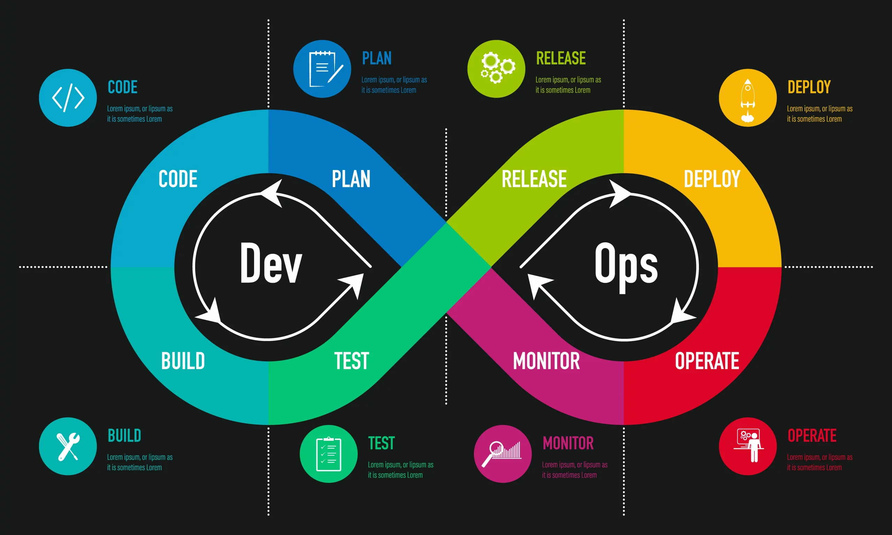

# DevOps Cheat-Sheet 

Welcome to the DevOps Cheat Sheet, your quick reference guide to the essential tools, practices, and concepts in the world of DevOps. DevOps, a blend of "Development" and "Operations," is a set of practices that aim to shorten the development lifecycle and deliver high-quality software continuously. This cheat sheet is designed to help you navigate the core elements of DevOps, from automation and continuous integration to monitoring and security.

## :pushpin: Table Of Content

1. [What is DevOps ?](1.%20What%20is%20DevOps.pdf)

We appreciate you using our cheat sheet collection! Enjoy coding! 🚀

